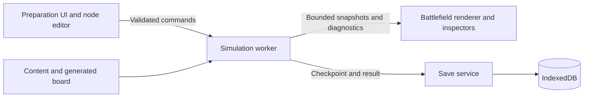

# Browser architecture

Status: architecture baseline, September 13, 2026. A playable implementation now exists. [Implementation notes](implementation-notes.md) document the selected technology, measured workloads, and differences from this baseline. Game rules are defined in [game-design.md](game-design.md).

## Runtime boundaries

Use TypeScript for application and simulation code. Keep the simulation independent of UI, rendering, browser storage, and wall-clock time. Choose build-tool and rendering-library versions when scaffolding, after a small rendering benchmark; no dependency versions are pinned by this document.

Use a dedicated worker for simulation and a main-thread application for menus, graph editing, and battlefield rendering. Workers can execute outside the main UI thread and communicate through messages. This isolates simulation work but does not make CPU cost disappear. [Web Workers API](https://developer.mozilla.org/en-US/docs/Web/API/Web_Workers_API)

Render the battlefield with batched GPU sprites through a thin renderer adapter. WebGL2 is the proposed baseline; validate on intended browsers before committing. Avoid one DOM element per enemy. Keep menus and inspectors in semantic HTML. WebGL2 provides a canvas graphics context suitable for this renderer. [WebGL2RenderingContext](https://developer.mozilla.org/en-US/docs/Web/API/WebGL2RenderingContext)



Proposed modules:

```text
src/
  app/          screens, state transitions, accessibility
  simulation/   fixed ticks, combat, routing, economy, seeded RNG
  automation/   graph schema, validation, compiler, execution
  generation/   board generator, validators, encounter budgets
  rendering/    renderer adapter, sprites, interpolation, effect budgets
  persistence/  schemas, transactions, migrations, import/export
  content/      enemies, towers, research, temporary upgrades
  workers/      simulation host and message protocol
  diagnostics/  counters, bounded timeline, summaries
```

## Deterministic simulation

Initial target: 30 fixed ticks per simulated second. Movement uses fixed-point positions along circuit edges; cooldowns use integer ticks. Specify rounding for damage and effects. Seed random streams separately for generation, encounters, and upgrade offers. Do not call unseeded randomness in simulation.

At each tick: process spawns; sample routine sensors; resolve commands by explicit priority; update routes and movement; resolve attacks/effects in stable entity order; update gate pressure and force failed gates open; resolve breaches, rewards, and attack termination. A gate failure affects movement on the following tick. Document simultaneous-event rules as combat evolves.

Attack completion requires exhausted spawns and no remaining hostile population. A destroyed core takes precedence over victory in the same tick. Apply each kill and breach once. Graph evaluation can run every third tick initially.

Speed controls change ticks requested per wall-clock second, never tick size or combat rules. Cap work per scheduling batch; if hardware cannot maintain requested speed, show reduced effective speed without skipping combat ticks. Backgrounding suspends wall-clock advancement; returning resumes without an accumulated catch-up burst.

Use typed-array stores or pooled records for hot entity state. Index candidates by circuit edge and distance bins; avoid every tower scanning every enemy every tick. Cache route distances and invalidate on gate topology changes. Central routing computes paths by topology revision, rather than running a full search for each virus.

Worker messages have a protocol version, request ID, attempt ID, and state revision. Reject stale commands. During attacks, accept playback and read-only inspection requests only. Transfer bounded render snapshots at a separately budgeted frequency, initially 15–30 Hz. Reuse buffers; avoid unbounded message queues. Visual interpolation must never feed back into simulation.

## Individual enemies and swarms

Separate **represented population**, **simulation records**, and **rendered sprites**. A swarm may represent many enemies and be drawn with a bounded number of sprites plus density effects. Labels and inspectors expose its actual count.

Grouping is a gameplay representation rule, not a response to measured FPS. Use deterministic population thresholds in versioned rules. Hardware-dependent grouping would change outcomes between devices and playback speeds. Visual density can independently adapt to GPU load.

Represent eligible ordinary enemies as cohorts with species, tier, route, distance bin, count, health bands, status/cooldown state, and stable ordering. Begin with count-one cohorts. Merge only compatible state. Keep specials individual. Split cohorts at junctions, range boundaries, and damage/status boundaries when required by the combat contract.

Do not merge arbitrary health values into a single average: it changes kill counts and single-target behavior. Track full-health members and a bounded set of partially damaged bands; split or refuse a merge when exact representation is unavailable. Single-target hits affect one member unless the weapon explicitly pierces. Area attacks operate on represented members in covered bins with explicit edge coverage. Queue pressure and rewards use member count, not record count.

Spatial quantization is an approximation that must be exposed as a fixed combat rule, shared by count-one and grouped representations. Exact equivalence to unrestricted continuous individual simulation is not promised. Validate a reference count-one implementation under the same quantized rules against grouped execution.

Conservation requirements: conversion preserves population, total health, statuses, credited kills, route progress under the binning rule, and breach liability. No reward arises merely from merging or splitting.

Fragmentation from statuses and partial damage can defeat compression. Limit supported status combinations in content, merge compatible bands, and generate high-tier encounters from bounded cohort templates. If exact cohort handling exceeds the budget, reduce effective playback speed; never delete enemies or silently change damage. Unlimited heterogeneous enemies cannot be guaranteed in finite memory.

Benchmark targets, not promises: 10,000 count-one basic enemies; 1,000,000 represented ordinary enemies using at most several thousand compatible cohorts; bounded special-enemy population. Measure both homogeneous swarms and adversarial fragmentation before expanding content.

## Node programming

Store nodes and typed ports as data; never execute arbitrary user JavaScript. Validate types, missing references, graph size, cycles, and action availability. Compile the graph into stable instructions. Evaluate against a tick snapshot; commit actions afterward so wire order does not introduce hidden state changes.

Use trigger-on-entry semantics by default, optional explicit repeat intervals, action cooldown checks, and visible rule priorities. Initial graphs are acyclic. Future feedback uses delay/state nodes with bounded state. Limit execution work and retain understandable warnings. Templates are ordinary editable graphs using the same validator.

Graph revisions freeze at attack launch. Diagnostics record successful actions and reason-coded failures; repeated identical events are summarized to bound memory.

## Generation and endless difficulty

Map identity is `(campaignSeed, levelIndex, generatorVersion)`. Persist the generated board, not only its seed. An attempt adds encounter and reward seeds. Generator steps: allocate bounded grid; place core and entrances; carve connected circuits; add junctions, optional detours and gate sites; reserve viable building space; decorate after validation.

Validate base reachability, grid bounds, core access, meaningful build sites, valid gate pressure behavior, and routing termination. Use bounded generation retries and a deterministic fallback board. Connectivity alone does not establish fair difficulty; playtest and reference-defense simulations evaluate encounter budgets separately.

Increase encounter budgets and tiers without unbounded map dimensions. Represent large progression indices and long-term currency with serialized big integers if necessary. Combat uses bounded local units and explicit tier scaling; never allow Number overflow, NaN, or Infinity to become game state. The concrete large-number balance model is a research task before claiming unlimited progression.

## Saving and settlement

Use IndexedDB for versioned structured saves and atomic transactions. It supports significant structured data and transactional storage; it is not a cloud backup. [IndexedDB API](https://developer.mozilla.org/en-US/docs/Web/API/IndexedDB_API)

Records: profile (campaign seed, research, purchased nodes, unlocked levels); board instances; active attempt (rules version, board, research snapshot, preparation state, seeds, graph, choices); settlement receipts; settings.

Before launch, commit the preparation checkpoint. On reload after an interrupted attack, restore that checkpoint and repeat the same encounter. No mid-attack resume in the initial slice. Between-wave reward selection and its committed choice are saved atomically so reloading cannot reroll offers.

Settle research, level unlocking, receipt creation, and active-attempt clearing in one transaction keyed by attempt ID. Retrying settlement must not duplicate rewards. A save failure remains visible and retryable; do not claim success until storage confirms it. Use save revisions and a single active writer policy to prevent two tabs overwriting progress.

Validate imported saves before applying them, preserve the current save until replacement commits, and provide explicit schema migrations. Export includes version information. Full reset clears profile and attempt data transactionally and creates a fresh campaign. Reset confirmation and import replacement are user-facing safeguards.

## Resource budgets and validation

Initial desktop targets: 60 FPS at 1080p, responsive graph editing, and under 256 MB total game memory in benchmark scenarios. These are provisional; record browser, hardware, GPU, resolution, simulated population, cohort count, and playback speed for every measurement.

Bound particles, trails, audio voices, timeline events, snapshots, and cached boards independently. Aggregate diagnostics into time buckets and retain a bounded detail window. Long attacks must not grow memory linearly with elapsed time.

Required evidence: deterministic state hashes across playback speeds; cohort conservation and differential combat checks; gate deadlock/pressure tests; generator property checks; idempotent settlement; migration/import validation; complete save/reload/reset flows; long-run memory profiles; actual browser/GPU measurements. Choose libraries after the smallest renderer and worker spike establishes these boundaries.
